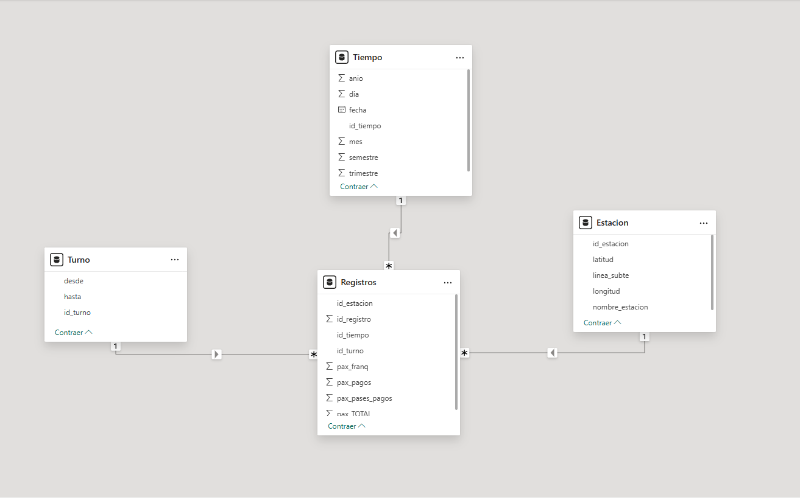

# 🚇 Subte Buenos Aires — Data Warehouse & Dashboard

Proyecto de ingeniería de datos y análisis que construye un **Data Warehouse en modelo estrella** a partir de registros abiertos de validaciones de molinetes del Subte de Buenos Aires, integrando un pipeline completo de:

- Ingesta de datos
- Limpieza y normalización
- Modelado dimensional en SQL Server
- Visualización en Power BI

---

## 📊 Objetivo

Transformar datos transaccionales crudos (CSV mensuales por línea de subte) en un sistema analítico que permita responder preguntas como:

- ¿Qué estaciones tienen mayor flujo de pasajeros?
- ¿Cómo varía la demanda por franja horaria?
- ¿Qué líneas concentran mayor volumen?
- ¿Cómo evolucionan los viajes a lo largo del tiempo?

---

## 🧱 Arquitectura del proyecto
CSV crudos → ETL en Python → Data Warehouse (SQL Server) → Power BI

Modelo dimensional utilizado: Esquema estrella con tabla de hechos `Registros` y dimensiones de `Tiempo`, `Estación`, `Línea`, `Turno`, etc.

---

## ⚙️ Stack tecnológico

- **Python**
- **Pandas**
- **SQLAlchemy**
- **SQL Server**
- **Power BI**

---

## 🔄 Flujo ETL

## 1️⃣ Concatenación de CSV
Script: `01_concatenacion_csvs.py`

- Une archivos mensuales por línea en un único dataset.

---

## 2️⃣ Normalización de datos
Script: `02_normalizacion_datos.py`

- Unificación de nombres de estaciones y líneas.
- Corrección de inconsistencias tipográficas.
- Estandarización de valores categóricos.

> Durante esta etapa se realizó exploración manual de valores únicos para detectar inconsistencias (por ejemplo: estaciones con múltiples variantes de escritura), luego corregidas mediante reglas explícitas en el script.

---

## 3️⃣ Limpieza
Script: `03_limpieza_datos.py`

- Conversión de fechas y tipos.
- Eliminación de registros inválidos.
- Preparación del dataset final para carga en DW.

---

## 4️⃣ Carga en Data Warehouse
Script: `04_carga_datawarehouse.py`

- Inserción idempotente en dimensiones.
- Resolución automática de claves foráneas.
- Carga incremental de tabla de hechos `Registros`.

---

## 🗄️ Data Warehouse

Base de datos en **SQL Server** modelada en esquema estrella:


## Dimensiones
- `Tiempo`
- `Estacion`
- `Turno`

## Hechos
- `Registros` (cantidad de validaciones)

Script de creación:
- `sql/01_schema_datawarehouse.sql`

Actualización manual de coordenadas geográficas:
- `sql/02_actualizacion_lat_long.sql`

---

## 📈 Dashboard

El archivo `dashboard/powerbi_dashboard.pbix` contiene visualizaciones interactivas como:

- Flujo de pasajeros por estación
- Evolución temporal de validaciones
- Comparación entre líneas
- Mapas geográficos con estaciones

---

##📌 Aprendizajes clave
Construcción de pipelines ETL reproducibles

Normalización de datasets reales con inconsistencias semánticas

Modelado dimensional (modelo estrella)

Integración Python → SQL Server → Power BI

Manejo de claves foráneas y cargas idempotentes

##🚀 Posibles mejoras futuras
Automatizar coordenadas geográficas vía API

Incorporar tests de calidad de datos

Parametrizar conexión a DB por entorno

Orquestar pipeline con Airflow o Prefect

## ▶️ Cómo ejecutar el proyecto
```bash
1️⃣ Clonar repositorio
git clone https://github.com/tuusuario/subte-molinetes-dw.git
cd subte-molinetes-dw

2️⃣ Crear entorno virtual
python -m venv venv
venv\Scripts\activate
pip install -r requirements.txt

3️⃣ Ejecutar pipeline
python scripts/01_concatenacion_csvs.py
python scripts/02_normalizacion_datos.py
python scripts/03_limpieza_datos.py
python scripts/04_carga_datawarehouse.py

4️⃣ Abrir Power BI
dashboard/powerbi_dashboard.pbix


---

##👤 Autor
Pablo Foix
Data Analyst / Data Engineering Jr
📫 Contacto: (pabloffoix@gmail.com)
